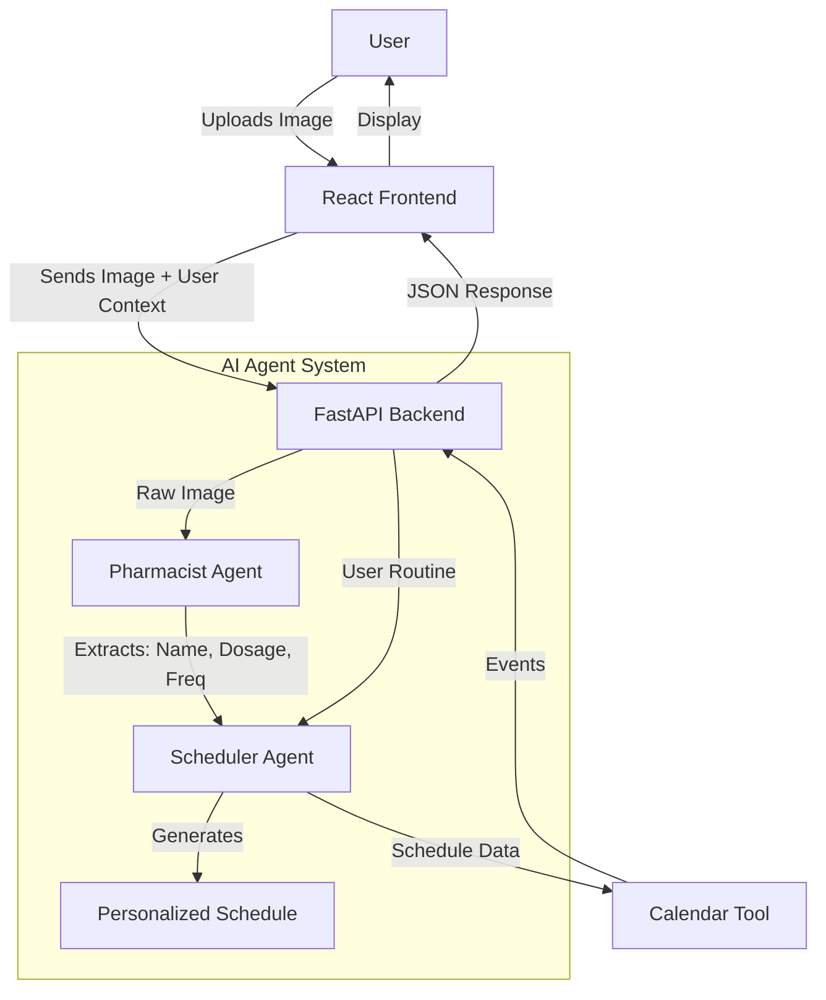

# Medora - Your Personal Medication Concierge

**Track:** Concierge Agents

## 📖 Overview

**Medora** is an intelligent AI agent designed to simplify medication management. It acts as your personal pharmacist and scheduler, taking the complexity out of deciphering prescription bottles and organizing your daily intake.

### The Problem
Managing multiple medications can be overwhelming. Patients often struggle to:
- Decipher complex instructions on prescription bottles (e.g., "Take 1 tablet twice daily with food").
- Coordinate these instructions with their personal daily routine (wake up time, meal times, sleep time).
- Remember when to take each pill, leading to missed doses or accidental double-dosing.

### The Solution
Medora solves this by using a multi-agent system to:
1.  **See & Understand:** A **Pharmacist Agent** (powered by Gemini 2.0 Flash Lite Vision) analyzes images of prescription bottles to extract drug names, dosages, and frequencies with high accuracy.
2.  **Plan & Schedule:** A **Scheduler Agent** (powered by Gemini 2.0 Flash Lite) takes this raw data and your personal daily routine (e.g., "I wake up at 7 AM and eat lunch at 1 PM") to generate a conflict-free, personalized schedule.
3.  **Action:** A **Calendar Tool** (simulated) then populates your calendar with these reminders.

---

## 🏗️ Architecture

Medora utilizes a multi-agent architecture to separate concerns between visual perception and logical reasoning.



### Key Concepts Applied
1.  **Multi-Agent System:**
    -   **Pharmacist Agent:** Specialized in OCR and medical entity extraction from images.
    -   **Scheduler Agent:** Specialized in temporal reasoning and constraint satisfaction (matching pills to meal times).
2.  **Tools:**
    -   **Calendar Tool:** A custom tool designed to interface with external calendar APIs (simulated for this prototype).
3.  **LLM Power:**
    -   Leverages **Google Gemini 2.0 Flash Lite** (via `Google-ADK`) for both multimodal understanding (Vision) and complex reasoning.
4.  **Human-in-the-loop:**
    -   **Terminal Oversight:** Real-time logging allows human verification of the AI's reasoning before scheduling.

---

## 🚀 Getting Started

Follow these instructions to set up the project locally.

### Prerequisites
-   Python 3.9+
-   Node.js & npm
-   Google Gemini API Key

### Backend Setup

1.  Navigate to the backend directory:
    ```bash
    cd backend
    ```

2.  Create and activate a virtual environment:
    ```bash
    python -m venv venv
    source venv/bin/activate  # On Windows: venv\Scripts\activate
    ```

3.  Install dependencies:
    ```bash
    pip install -r requirements.txt
    ```

4.  Set up environment variables:
    Create a `.env` file in the `backend` directory and add your API key:
    ```env
    GEMINI_API_KEY=your_actual_api_key_here
    ```

5.  Run the server:
    ```bash
    uvicorn app.main:app --reload
    ```
    The backend will start at `http://localhost:8000`.

### Frontend Setup

1.  Navigate to the frontend directory:
    ```bash
    cd frontend
    ```

2.  Install dependencies:
    ```bash
    npm install
    ```

3.  Run the development server:
    ```bash
    npm run dev
    ```
    The app will open at `http://localhost:5173`.

---

## 💡 Usage Guide

1.  **Onboarding:** Enter your daily routine (Wake up time, Breakfast, Lunch, Dinner, Bedtime).
2.  **Upload:** Take a photo of your prescription bottle and upload it.
3.  **Review:** The Pharmacist Agent will identify the medication.
4.  **Schedule:** The Scheduler Agent will propose a schedule (e.g., "Take Metformin at 8:00 AM with Breakfast").
5.  **Confirm:** Accept the schedule to add it to your calendar.

---

## 🔮 Future Scope

-   **Long-term Memory:** Implementing a persistent database (e.g., vector store) to remember user preferences and medication history over months.
-   **MCP Integration:** Expanding the toolset using the Model Context Protocol (MCP) to connect with real-world pharmacy APIs for refill requests and drug interaction checks.

---

